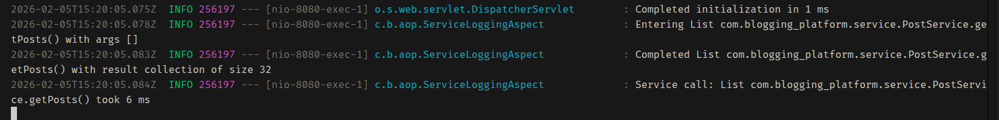
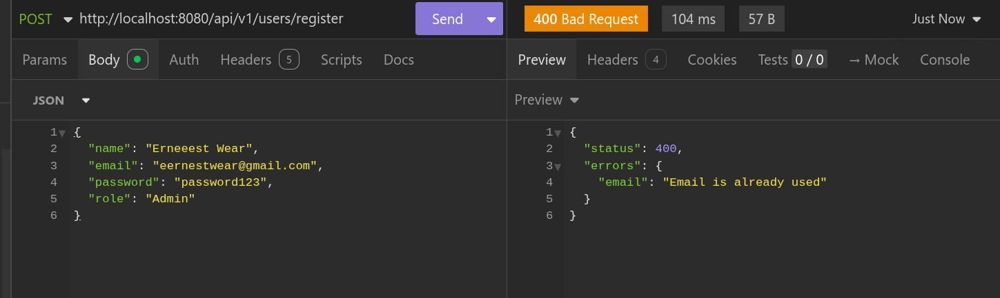

# Blogging Platform

A Spring Boot blogging backend with REST and GraphQL APIs, backed by MySQL, featuring user authentication, post management with tags, review system (ratings), commenting, and advanced in-memory search/sort capabilities using data structures and algorithms (hashing, caching, QuickSort).

## Features

- **User Management**: Registration and authentication with role-based access (Admin/Regular)
- **Post Management**: Create, edit, delete, and publish blog posts with draft/published status
- **Tag System**: Categorize posts with tags; create tags (Admin only); link tags to posts
- **Review System**: Rate posts (1-5 stars) with messages; view average ratings; edit/delete reviews (author or admin post-owner)
- **Comment System**: Add, edit, and delete comments on posts (author-only edit/delete)
- **Advanced Search & Sort**: 
  - In-memory search by title, author, or tag (cache-based, no DB queries)
  - QuickSort-based sorting by date, title, or author (ascending/descending)
  - Search and sort on home page and admin post list
- **Caching**: In-memory cache with hash index (O(1) lookup) and tag index for fast search
- **Session Management**: Secure session handling for authenticated users
- **Custom Exception Handling**: Comprehensive exception hierarchy for error management
- **DAO/Service Architecture**: Clean separation with DAO interfaces, JDBC implementations, and service layer

## Prerequisites

- **Java Development Kit (JDK) 21** or higher
- **Maven 3.6+** for dependency management
- **MySQL 8.0+** database server

## Database Schema

The application uses a MySQL database with the following structure:

### Entity-Relationship Diagram
See the complete ERD diagram at: [`docs/blogging_platform_erd.png`](docs/blogging_platform_erd.png)

### Database Tables

- **users**: Stores user accounts with name, email, role, and hashed password
- **posts**: Stores blog posts with title, content, status (DRAFT/PUBLISHED/DELETED), and publication date
- **comments**: Stores user comments on posts with metadata support
- **tags**: Stores available tags for categorizing posts
- **post_tags**: Junction table for many-to-many relationship between posts and tags
- **reviews**: Stores post reviews with rating (1-5), message, and timestamps (one review per user per post)

### SQL Scripts

The complete database schema and setup scripts are available at:
- [`docs/blogging_platform.sql`](docs/blogging_platform.sql) - MySQL schema with indexes and foreign keys

## Setup Instructions

### 1. Clone the Repository

```bash
git clone <repository-url>
cd blogging_platform
```

### 2. Database Setup

1. **Start MySQL Server**
   ```bash
   # On Linux/Mac
   sudo systemctl start mysql
   # Or
   sudo service mysql start
   
   # On Windows, start MySQL service from Services panel
   ```

2. **Create the Database**
   ```bash
   mysql -u root -p
   ```
   ```sql
   CREATE DATABASE blogging_platform;
   USE blogging_platform;
   ```

3. **Run the SQL Script**
   ```bash
   mysql -u root -p blogging_platform < docs/blogging_platform.sql
   ```
   Or execute the SQL file contents directly in your MySQL client.

### 3. Configuration

Database configuration is managed via Spring Boot `application.properties` (and profile-specific variants like `application-dev.properties`):

```properties
spring.datasource.url=jdbc:mysql://localhost:3306/blogging_platform?allowPublicKeyRetrieval=true&useSSL=false
spring.datasource.username=your_mysql_username
spring.datasource.password=your_mysql_password
spring.datasource.driver-class-name=com.mysql.cj.jdbc.Driver
server.servlet.context-path=/api/v1
```

Update the database name and credentials to match your local MySQL setup.

### 4. Install Dependencies

Maven will automatically download all required dependencies when you build or run the project:

```bash
mvn clean install
```

## Dependencies

The project uses the following key dependencies (managed via Maven):

### Core Dependencies
- **Spring Boot**:
  - `spring-boot-starter-web` – REST API
  - `spring-boot-starter-graphql` – GraphQL endpoint on `/graphql`
  - `spring-boot-starter-data-jpa` and `spring-boot-starter-jdbc` – data access
  - `spring-boot-starter-validation` – Bean validation (Jakarta Validation)
  - `spring-boot-starter-aop` – cross-cutting logging and performance monitoring
- **springdoc-openapi** – interactive REST docs at `/swagger-ui.html`
- **MySQL Connector/J** – MySQL database driver
- **jBCrypt 0.4** – Password hashing library

### Test Dependencies
- **JUnit Jupiter 5.10.0**: Unit testing framework
- **Mockito 5.7.0**: Mocking framework for tests
- **TestFX 4.0.18**: JavaFX testing utilities

All dependencies are defined in [`pom.xml`](pom.xml) and will be automatically resolved by Maven.

## Execution Instructions

### Running the Application

#### Option 1: Using Maven (Recommended)

```bash
mvn javafx:run
```

#### Option 2: Using Java directly

1. **Compile the project:**
   ```bash
   mvn clean compile
   ```

2. **Run the application:**
   ```bash
   java --module-path <path-to-javafx-libs> --add-modules javafx.controls,javafx.fxml --enable-native-access=javafx.graphics -cp target/classes com.blogging_platform.App
   ```

#### Option 3: Using IDE

1. **IntelliJ IDEA / Eclipse:**
   - Import the project as a Maven project
   - Set the main class to `com.blogging_platform.App`
   - Add VM options: `--enable-native-access=javafx.graphics`
   - Run the `App` class

2. **VS Code:**
   - Use the Java Extension Pack
   - Open the project folder
   - Run the "Launch Blogging Platform" configuration from `.vscode/launch.json`

### Application Flow

1. **Login Screen**: The application starts at the login screen
2. **Registration**: New users can register with name, email, role (Admin/Regular), and password
3. **Post Home**: After login, users see published posts with:
   - Search by title, author, or tag (in-memory, cache-based)
   - Sort by date (newest/oldest), title (A-Z/Z-A), or author (A-Z/Z-A)
   - Post cards showing tags, comment count, and average rating
4. **Post Management**: 
   - Admins can access "My Posts" to create, edit, and delete posts
   - Posts can be saved as Draft or Published
   - Tags can be assigned when creating or editing posts
   - Admin can create new tags
5. **Post Viewing**: Click on any post to view:
   - Full content, tags, and average rating
   - Comments (add, edit, delete - author only)
   - Click rating to view all reviews
6. **Review Page**: View and manage reviews for a post:
   - See all reviews with author, rating, and message
   - Add a review (one per user per post)
   - Edit/delete your own review
   - Admin post-owner can delete any review on their post
7. **Commenting**: Authenticated users can add, edit (author only), and delete (author only) comments

## Testing

### Running Tests

Execute all tests using Maven:

```bash
mvn test
```

### Test Structure

Tests are located in `src/test/java/com/blogging_platform/`:

- **Controller Tests**: Validation and business logic tests for each controller
  - `LoginUserControllerTest.java`
  - `RegisterUserControllerTest.java`
  - `AddPostControllerTest.java`
  - `EditPostControllerTest.java`
  - `PostListControllerTest.java`
  - `SinglePostControllerTest.java`
  - `PostHomeControllerTest.java`

- **Exception Tests**: Tests for custom exception hierarchy
  - Located in `src/test/java/com/blogging_platform/exceptions/`

### Test Requirements

- JavaFX Platform must be initialized for controller tests
- Tests use reflection to initialize FXML fields
- Database connection is not required for unit tests (they test validation and business logic)

## Project Structure

```
blogging_platform/
├── docs/
│   ├── blogging_platform_erd.png      # Entity-Relationship Diagram
│   ├── blogging_platform.sql          # MySQL database schema
│   ├── performance_review.sql         # Performance optimization queries
│   ├── swagger_ui.png                 # REST API documentation (Swagger UI)
│   ├── graphql1.png                   # GraphQL schema / queries
│   ├── graphql2.png                   # GraphQL mutations
│   ├── custom_validation.png          # Bean validation & error handling
│   └── aop_logging.png                # AOP logging and performance metrics
├── src/
│   ├── main/
│   │   ├── java/com/blogging_platform/
│   │   │   ├── Main.java              # Spring Boot entry point
│   │   │   ├── ApiResponse.java       # Standard API response wrapper
│   │   │   ├── aop/                   # Cross‑cutting concerns
│   │   │   │   └── ServiceLoggingAspect.java
│   │   │   ├── classes/               # Data records and utilities
│   │   │   │   ├── CacheManager.java
│   │   │   │   ├── PagedResult.java
│   │   │   │   ├── PostRecord.java
│   │   │   │   ├── CommentRecord.java
│   │   │   │   ├── ReviewRecord.java
│   │   │   │   ├── TagRecord.java
│   │   │   │   └── UserRecord.java
│   │   │   ├── config/                # Infrastructure configuration
│   │   │   │   ├── Config.java        # .env loader (legacy support)
│   │   │   │   ├── DBConnection.java  # JDBC connection helper using Spring DataSource
│   │   │   │   └── DatabaseConfig.java# Wires Spring DataSource into DBConnection
│   │   │   ├── controller/            # REST + GraphQL controllers (BEM‑05 Web & GraphQL)
│   │   │   │   ├── PostController.java
│   │   │   │   ├── UserController.java
│   │   │   │   ├── CommentController.java
│   │   │   │   ├── ReviewController.java
│   │   │   │   └── TagController.java
│   │   │   ├── dao/                   # Data Access Layer
│   │   │   │   ├── interfaces/        # DAO interfaces
│   │   │   │   │   ├── PostDAO.java
│   │   │   │   │   ├── UserDAO.java
│   │   │   │   │   ├── CommentDAO.java
│   │   │   │   │   ├── TagDAO.java
│   │   │   │   │   └── ReviewDAO.java
│   │   │   │   └── implementation/    # JDBC implementations
│   │   │   │       ├── JdbcPostDAO.java
│   │   │   │       ├── JdbcUserDAO.java
│   │   │   │       ├── JdbcCommentDAO.java
│   │   │   │       ├── JdbcTagDAO.java
│   │   │   │       └── JdbcReviewDAO.java
│   │   │   ├── service/               # Business logic layer
│   │   │   │   ├── PostService.java
│   │   │   │   ├── UserService.java
│   │   │   │   ├── CommentService.java
│   │   │   │   ├── TagService.java
│   │   │   │   └── ReviewService.java
│   │   │   ├── model/                 # Domain models (JPA entities)
│   │   │   │   ├── Post.java
│   │   │   │   ├── User.java
│   │   │   │   ├── Comment.java
│   │   │   │   ├── Review.java
│   │   │   │   └── Tag.java
│   │   │   ├── exceptions/            # Custom exception hierarchy
│   │   │   │   ├── BloggingPlatformException.java
│   │   │   │   ├── DatabaseException.java
│   │   │   │   ├── GlobalExceptionHandler.java      # REST error handling
│   │   │   │   └── GraphQLExceptionHandler.java     # GraphQL error handling
│   │   │   └── validation/            # Bean validation helpers
│   │   │       ├── UniqueEmail.java
│   │   │       └── UniqueEmailValidator.java
│   │   └── resources/
│   │       ├── application.properties             # Default Spring Boot config
│   │       ├── application-dev.properties         # Dev profile config
│   │       ├── application-test.properties        # Test profile config
│   │       ├── application-prod.properties        # Prod profile config
│   │       └── graphql/schema.graphqls            # GraphQL schema (queries + mutations)
│   └── test/
│       └── java/com/blogging_platform/
│           └── exceptions/                        # Exception tests (existing)
├── pom.xml                            # Maven configuration
├── README.md                          # This file
└── .env                               # Optional environment configuration (legacy)
```

## Architecture & Performance

### Cross‑Cutting Concerns (AOP)

The service layer is instrumented with Spring AOP to provide centralized logging and performance monitoring (Epic **BEM‑05 AOP Logging & Monitoring**):

- A `ServiceLoggingAspect` applies `@Before`, `@AfterReturning`, and `@Around` advice to all public methods in `com.blogging_platform.service.*`.
- Each service call logs method name, arguments, and either the returned object or (for collections) the collection size for easier debugging.
- The `@Around` advice measures execution time and logs slow calls (over 500 ms) as warnings; all calls log their duration in milliseconds.
- Example log output is illustrated in `docs/aop_logging.png`:  
  

### Data Structures & Algorithms Integration

The application implements several D&S concepts:

- **Hashing/Caching**: 
  - `CacheManager` uses `ConcurrentHashMap` for O(1) post lookup by id (hash index)
  - In-memory cache stores published posts and tag associations
  - Cache invalidation after comment/review create/update/delete

- **Sorting**: 
  - QuickSort algorithm implemented in `CacheManager.sortPosts()` for O(n log n) average performance
  - Supports sorting by date, title, or author (ascending/descending)

- **Searching**: 
  - In-memory linear search on cached posts (filters by title, author, or tag)
  - No database queries for search - all filtering happens in memory
  - Tag index (`postIdToTagNames`) enables fast tag-based search

- **Indexing Concept**: 
  - Hash index (`postByIdCache`) analogous to database primary key index
  - Tag index (`postIdToTagNames`) for efficient tag lookups
  - In-memory structures mirror database indexing principles

### Search & Sort Implementation

- **Home Page & Post List**: Search and sort run entirely in memory using cached data
- **No Database Queries**: Search filters cached posts; sort uses QuickSort on filtered results
- **Performance**: O(n) search + O(n log n) sort = efficient for typical post counts

### Legacy MySQL FULLTEXT Search

The application previously used MySQL FULLTEXT search (still available in `MySQLDriver`):

- FULLTEXT indexes on `posts.title` and `users.name`
- Uses `MATCH() AGAINST()` in NATURAL LANGUAGE MODE
- Relevance-based sorting
- Expected 10-100x faster on large datasets (1000+ posts)

See [`docs/performance_review.sql`](docs/performance_review.sql) for optimization details.

**Note**: Current implementation prefers cache-based in-memory search/sort for better responsiveness.

## Recent Updates

### Latest Changes (2026)

- **Documentation**: Comprehensive Javadocs added to all classes, methods, and interfaces
- **Code Cleanup**: Removed commented-out code and debug statements
- **Cache-Based Search & Sort**: In-memory search by title/author/tag with QuickSort (D&S integration)
- **Tags & Reviews**: Full tag management and review system (ratings 1-5) with authorization
- **Cache Invalidation**: Automatic cache refresh after comment/review create/update/delete
- **Edit Post Tags**: Tag field added to edit post screen
- **Architecture**: Migrated to DAO/Service layer pattern for better separation of concerns
- **BEM‑05 Web & GraphQL**: Introduced Spring Boot REST controllers and GraphQL mappings for posts, users, comments, reviews, and tags (see screenshots in `docs/graphql1.png` and `docs/graphql2.png`).
- **BEM‑05 Validation & Exceptions**: Centralized validation and error handling via `GlobalExceptionHandler` and `GraphQLExceptionHandler`, with field‑level constraints (see `docs/custom_validation.png`).  
  
- **BEM‑05 AOP Logging & Monitoring**: Added `ServiceLoggingAspect` for request tracing and performance metrics on service methods (see `docs/aop_logging.png`).

See git log for detailed commit history.

## Troubleshooting

### Database Connection Issues

1. **Check MySQL is running:**
   ```bash
   sudo systemctl status mysql
   ```

2. **Verify database exists:**
   ```sql
   SHOW DATABASES;
   ```

3. **Check credentials in `.env` file:**
   - Ensure `DB_NAME`, `USERNAME`, and `PASSWORD` are correct
   - Remove any quotes around values

### JavaFX Runtime Issues

- Ensure JavaFX dependencies are properly downloaded: `mvn dependency:resolve`
- For Java 21+, ensure `--enable-native-access=javafx.graphics` VM option is set
- Check that JavaFX modules are accessible in module path

### Build Issues

- Clean and rebuild: `mvn clean install`
- Check Java version: `java -version` (should be 21+)
- Verify Maven installation: `mvn -version`

## Documentation

All classes, methods, and interfaces are fully documented with Javadoc comments following Java best practices. Generate documentation using:

```bash
mvn javadoc:javadoc
```

The generated documentation will be available in `target/site/apidocs/`.

## License

[Add your license information here]